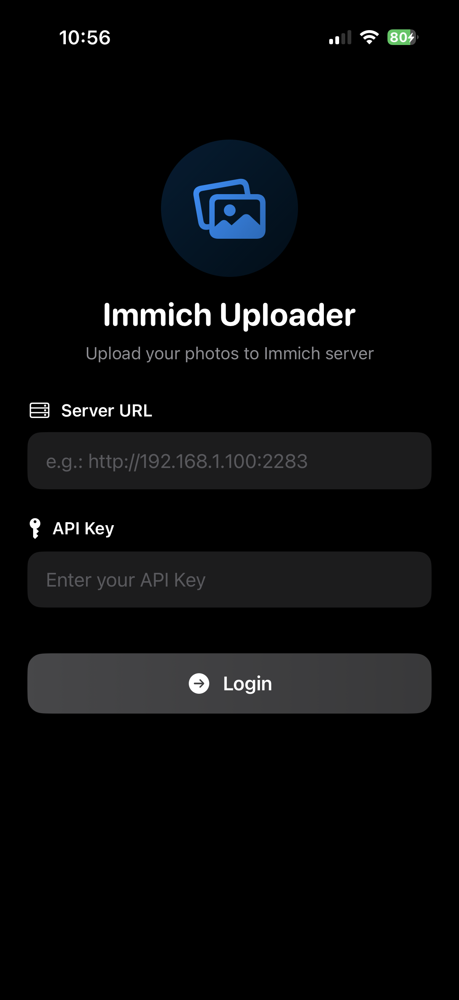
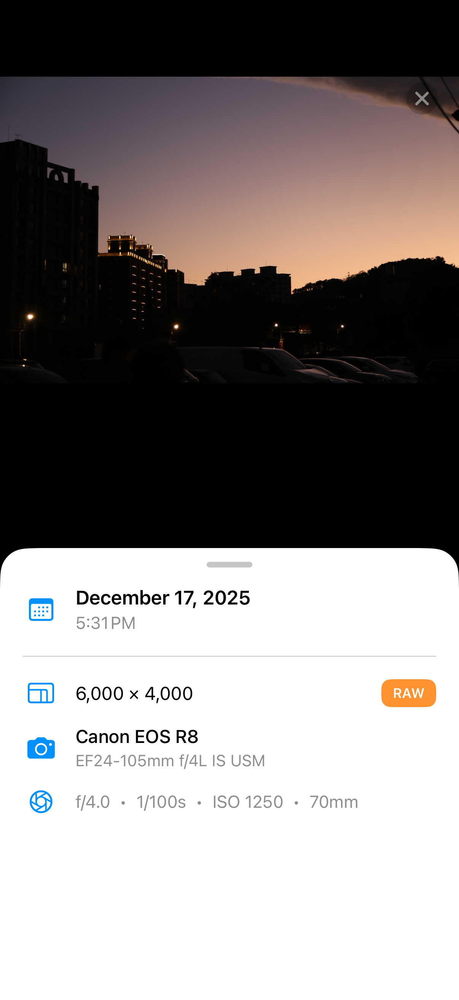
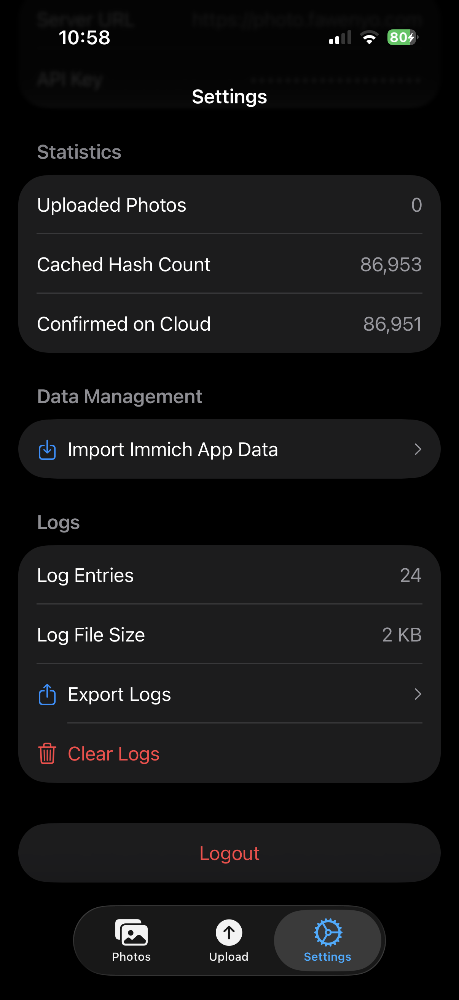

# YAIIU - Yet Another Immich iOS Uploader

**YAIIU** is a lightweight, unofficial iOS app designed to complement the official Immich iOS app — not replace it.

This project focuses on solving a few specific pain points that currently affect certain Immich users on iOS, especially photographers who rely on **JPEG + RAW workflows** and **background uploads**.

The app is open source, experimental, and contributions are very welcome 🙌

## Disclaimer

This is a unofficial project and has no affiliation with the official Immich project. Use at your own risk.

If you find any issues, please report them on this repository only but not on the official Immich channels.

## Why This App Exists

The official Immich iOS app is great, but there are a few limitations that impact some workflows:

### 1. JPEG + RAW Upload Support

When a photo in Apple Photos contains both **JPEG + RAW**, the official Immich iOS app currently uploads **only the JPEG**.

- This app uploads **both JPEG and RAW**.
- A fix has already been proposed upstream:
  - Immich PR: https://github.com/immich-app/immich/pull/24777
- However, the merge timeline is uncertain, so this app provides an immediate workaround.

### 2. iOS Background Uploads (iOS 26.1+)

Apple introduced a new PhotoKit API in iOS 26.1 that enables **true background uploads**:

- `Uploading Asset Resources in the Background`
- Apple documentation: https://developer.apple.com/documentation/photokit/uploading-asset-resources-in-the-background

At the moment, this is **not yet supported** by the official Immich iOS app.

**YAIIU now supports this feature!** However, due to iOS limitations with background upload extensions, you need to deploy an additional [immich-proxy](immich-proxy/README.md) server that sits between your iOS device and Immich server. Also note that this app needs to connect to GitHub for network access validation.

## Requirements

- iOS 17.0 or later (iOS 26.1+ for background uploads)
- An existing Immich server
- Immich API key

## Current Features

- 🔑 **Immich API Key authentication**
- 📦 **Import Immich SQLite database**
  - Allows users to reuse SQLite database dumped from the official Immich app
  - Avoids re-hashing all photos and videos
- 🖼 **JPEG + RAW upload support**
  - Correctly uploads both resources from Apple Photos
- 🚀 **iOS 26.1+ Background Upload Support**
  - Utilizes Apple's new `PHBackgroundResourceUploadExtension` API
  - Enables true background photo uploads
  - **Requires deploying [immich-proxy](immich-proxy/README.md)** - a proxy server that converts Apple background upload data to Immich-compatible multipart format

## Screenshots

| Login Page| Import Database | Photo Viewer | Settings |
| --- | --- | --- | --- |
|  |  |  |  |

## Planned Features / Roadmap

- 🌐 **Browse remote photos from Immich server**
  - In addition to local Photos library

## Non-Goals

To keep the scope clear:

- This app is **NOT** intended to replace the official Immich iOS app
- It does **NOT** aim to implement full Immich client features
- It focuses only on specific upload-related workflows

## Development Notes

⚠️ **Note:** This project was developed with AI assistance As a result, some parts of the codebase may be less organized or follow inconsistent patterns. Code refactoring and cleanup contributions are especially welcome!

## Contributing

Contributions are very welcome, please feel free to open issues or submit PRs, even small PRs are appreciated!

## License

AGPL-3.0 License
